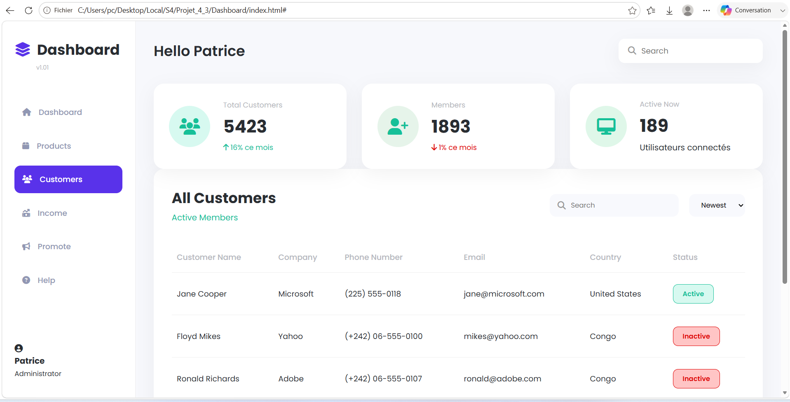

# README – Branche dev – Dashboard Admin

Cette documentation décrit la version actuelle du projet sur la branche dev. Il s’agit d’un tableau de bord administratif statique développé en HTML et CSS, dans l’objectif de reproduire une interface moderne de gestion de données. Le design s’inspire d’un dashboard d’administration avec une barre latérale, un en-tête, des cartes de statistiques et un tableau de clients.

## aperçu

## 1. Objectif du projet

Le but de ce projet est de proposer une maquette de tableau de bord professionnelle utilisée pour :

- visualiser des métriques importantes ;
- consulter la liste des clients ;
- présenter une navigation latérale claire ;
- offrir une interface propre et moderne.

La branche dev correspond à une version plus complète, avec une mise en page structurée et des composants plus réalistes.

## 2. Vue d’ensemble du projet

Le dashboard est composé de plusieurs zones distinctes :

1. une sidebar de navigation ;
2. une zone principale contenant l’en-tête ;
3. des cartes de statistiques ;
4. une section clients avec tableau ;
5. un footer de bas de page.

L’ensemble donne une impression d’outil d’administration sérieux, pensé pour des applications web métier.

## 3. Fonctionnalités principales

### 3.1 Sidebar de navigation

La barre latérale contient :

- le logo du dashboard ;
- une liste de liens de navigation ;
- un profil utilisateur en bas.

L’élément actif est mis en évidence pour montrer la page courante, ici “Customers”.

### 3.2 En-tête du tableau de bord

L’en-tête affiche :

- un message de bienvenue ;
- une barre de recherche.

Cette zone permet de rappeler l’identité de l’utilisateur et d’introduire une interaction simple avec la page.

### 3.3 Cartes de statistiques

Le dashboard présente trois cartes de résumé :

- Total Customers ;
- Members ;
- Active Now.

Chaque carte contient :

- une icône ;
- un chiffre clé ;
- une indication de tendance ou de performance.

### 3.4 Section clients

La section clients contient :

- un titre et un sous-titre ;
- une barre d’outils de recherche ;
- un menu de sélection ;
- un tableau récapitulatif des utilisateurs.

Le tableau présente des informations comme :

- nom du client ;
- entreprise ;
- numéro de téléphone ;
- email ;
- pays ;
- statut.

### 3.5 Statuts visuels

Les statuts des utilisateurs sont affichés avec des badges colorés :

- vert pour les comptes actifs ;
- rouge pour les comptes inactifs.

## 4. Structure des fichiers

Le projet contient actuellement :

- index.html : structure complète du dashboard ;
- style.css : styles, couleurs, layout, responsive design ;
- README.md : documentation du projet.

## 5. Structure HTML

Le fichier index.html est organisé de manière modulaire :

- aside.sidebar pour la navigation latérale ;
- main.dashboard pour le contenu principal ;
- header.top-bar pour l’en-tête ;
- section.stats pour les cartes de statistiques ;
- section.customers pour le tableau clients ;
- footer pour le pied de page.

Cette organisation rend le code plus lisible et facile à étendre.

## 6. Style et mise en page

Le fichier CSS définit :

- un système de variables de couleurs ;
- une mise en page en deux colonnes avec sidebar et contenu ;
- des cartes arrondies avec ombres douces ;
- des styles pour les boutons, badges, tableaux et champs de recherche ;
- des règles responsive pour tablette et mobile.

Les couleurs utilisées sont sobres et professionnelles :

- violet pour l’identifiant principal ;
- vert pour les indicateurs positifs ;
- rouge pour les alertes ou états négatifs ;
- gris pour les textes secondaires.

## 7. Comportement responsive

Le dashboard a été pensé pour s’adapter à plusieurs formats d’écran.

### Grand écran

- la sidebar reste visible sur le côté ;
- le contenu principal s’affiche avec une mise en page équilibrée.

### Tablette

- la sidebar rétrécit ;
- les cartes de statistiques passent en une seule colonne pour éviter un rendu trop dense.

### Mobile

- la sidebar devient une barre de navigation pleine largeur en haut ;
- le tableau reste lisible grâce au débordement horizontal géré par la propriété overflow-x.

## 8. Technologies utilisées

Le projet utilise :

- HTML5 pour la structure ;
- CSS3 pour la mise en page et les styles ;
- Font Awesome pour les icônes ;
- Google Fonts pour la typographie ;
- aucune logique JavaScript n’est implémentée dans cette version.

## 9. Composants principaux de l’interface

### Sidebar

La sidebar contient les principales sections du dashboard, telles que Dashboard, Products, Customers, Income, Promote et Help.

### Cartes de métriques

Les cartes donnent un aperçu rapide de l’activité du système avec des chiffres et des tendances.

### Tableau de clients

Le tableau représente l’élément central du dashboard. Il permet de visualiser des données structurées de manière professionnelle.

## 10. Comment ouvrir le projet

Pour visualiser le dashboard localement :

1. ouvrir le dossier du projet ;
2. ouvrir index.html dans un navigateur ;
3. si nécessaire, utiliser un serveur local pour un rendu plus proche d’un environnement web réel.

## 11. Points forts de la branche dev

La branche dev apporte une version bien plus complète et maîtrisée :

- structure du dashboard plus claire ;
- mise en page plus moderne ;
- section statistique plus réaliste ;
- tableau de clients plus abouti ;
- design responsive cohérent.

## 12. Améliorations possibles

Les extensions futures pourraient inclure :

- des graphiques interactifs ;
- un menu mobile plus avancé ;
- des filtres et tris dynamiques ;
- une intégration avec une base de données ou une API.

## 13. Conclusion

Cette version de la branche dev constitue une excellente base pour un tableau de bord administrateur moderne et fonctionnel. Elle montre qu’il est possible de créer une interface utilisateur professionnelle avec seulement HTML et CSS, tout en conservant une structure propre et évolutive.
